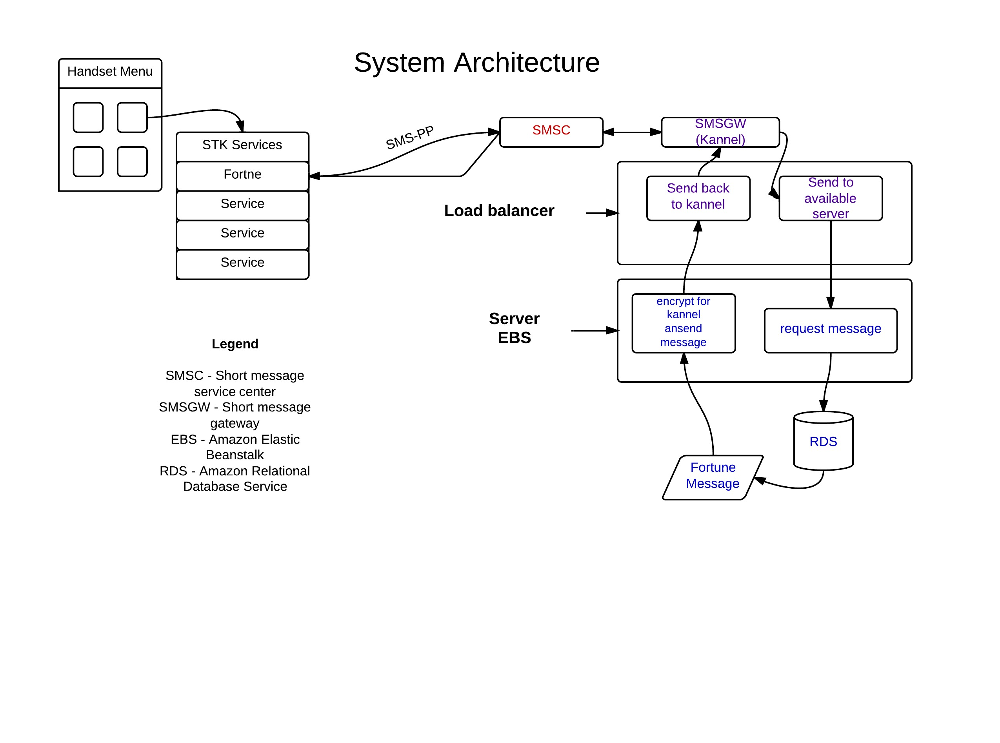
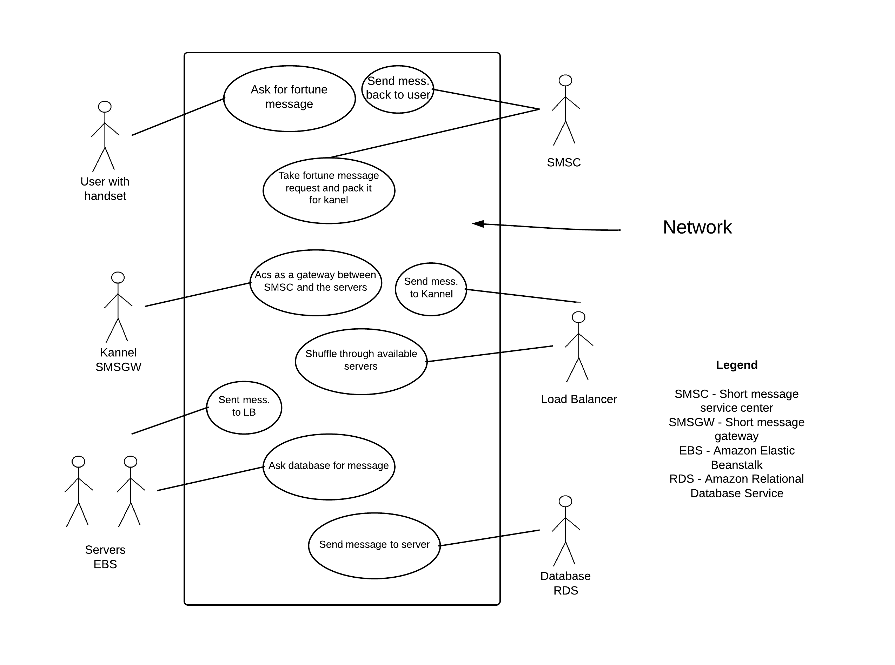

# Software Requirements
###for JavaCard Development Simulity
Version 1.1	 
Team OmadaProgramming(Team 15)	 
Members:	 
Brasoveanu Andrei Alexandru
Delvin Varghese
Dominic Lee
Konstantinos Akrivos

####Table of Contents
1.  Introduction	
	1.1	Purpose 	
	1.2	Document Conventions 	
	1.3	Intended Audience and Reading Suggestions 	
	1.4	Project Scope 	
	1.5	References	
2.	Overall Description 	
	2.1	Product Perspective 
	2.2	Product Features 	
	2.3	User Classes and Characteristics 	
	2.4	Operating Environment 	
	2.5	Design and Implementation Constraints 	
	2.6	User Documentation 	
	2.7	Assumptions and Dependencies	
3.	System Features	 	
4.	External Interface Requirements 	
	4.1	User Interfaces 	
	4.2	Hardware Interfaces	 
	4.3	Software Interfaces	 
	4.4	Communications Interfaces 	
5.	Other Nonfunctional Requirements 	
	5.1	Performance Requirements 	
	5.2	Safety Requirements	 
	5.3	Security Requirements	 
	5.4	Software Quality Attributes	 	
6.	Other Requirements	 	
Appendix A: Glossary	 	
Appendix B: Analysis Models	 	
Appendix C: Issues List	 	

#### 1. Introduction
#####1.1 Purpose
Developing a 'fortune 
cookie' (cf. unix 'fortune') application which is to be deployed with JavaCard technology.
The client's marketing research has shown that a niece for such an application exists in several countries were most of the population will find this useful for religious or superstition reasons.
Also the targeted market is present in geographical areas were the most used mobile devices are not smart phones, 
as so the application requires development on a module available to all devices, the SIM card. 
In essence the architecture establishes a connection between the handset and a http server, this can be used for 
future development that would allow bringing social networks to user without reach of more modern machines.
#####1.2 Document Conventions
Abbreviations 
WAP : Wireless Application Protocol 
HTTP : Hypertext Transfer Protocol 
SIM : Subscriber identity module 
*nix : Unix based 
SMS : Short Message Service 
MSISDN : Mobile Subscriber Integrated Services Digital Network-Number 
SMSC : short message service center 
SMSGW : SMS Gateway
#####1.3	Intended Audience and Reading Suggestions
The document is intended for readers involved in the project directly or indirectly. The technical value of the document is intended for someone with knowledge of development methodologies in programming and networking. 
#####1.4	Project Scope
The project aims to give user that do not have access to moder handsets to new technologies. Ultimatly the scope is to construct a 
basic architecture that can be used for frture advances in the area.
#####1.5	References
1.[http://en.wikipedia.org/wiki/Fortune_(Unix)](http://en.wikipedia.org/wiki/Fortune_(Unix)) 
2.[http://www.kannel.org/](http://www.kannel.org/) 
3.[http://en.wikipedia.org/wiki/Javacard](http://en.wikipedia.org/wiki/Javacard)
4.[http://en.wikipedia.org/wiki/Kannel_(telecommunications)](http://en.wikipedia.org/wiki/Kannel_(telecommunications))
5.[http://en.wikipedia.org/wiki/SMS](http://en.wikipedia.org/wiki/SMS)
6.[http://en.wikipedia.org/wiki/SMS_gateway](http://en.wikipedia.org/wiki/SMS_gateway)
7.[http://en.wikipedia.org/wiki/Hypertext_Transfer_Protocol](http://en.wikipedia.org/wiki/Hypertext_Transfer_Protocol)

####2.	Overall Description
#####2.1	Product Perspective
Diagram of project's major components 

#####2.2	Product Features
The product sole feature is to display a message when requested.
#####2.3	User Classes and Characteristics
N/A
#####2.4	Operating Environment
The environment targeted is that of a SIM card. The specific technology that will be used for implementation is JavaCard.
#####2.5	Design and Implementation Constraints
Kannel implementation will be required.For this part of the project, development will have to be done on a *nix based operating system.
Kannel requires the following software environment:

C compiler and development libraries and related tools.
The gnome-xml (a.k.a. libxml) library, version 2.2.0 or newer. 
POSIX threads (pthread.h).
GNU Bison 1.28 if you modify the WMLScript compiler.
DocBook markup language tools (jade, jadetex, DocBook style-sheets, etc; see README.docbook).(see ref.2)
####3.	System Features	
N/A
####4.	External Interface Requirements
#####4.1	User Interfaces
The applets user interface is test based and has only one option, requiesting a fortune message.
#####4.2	Hardware Interfaces
Communication between the applet and the server that will return our message will have three stages.Firstly the handset will send a SMS-PP to an SMSC server, from here the data is sent to Kannel.Kannel transform the WAP recieved data into valid HTTP packets.This packet is then sent to a load balancer which delivers it to the first available server in the cluster.Kannel is a compact and very powerful open source WAP and SMS gateway, used widely across the globe both for serving trillions of short messages (SMS), WAP Push service indications and mobile internet connectivity.(see ref.2)
The server and database are deploied on the AWS cloud , this was our choice since it provides a strong infrastructure. The servers are instances of AWS EBS and the database is a RDS. AWS Elastic Beanstalk automatically handles the deployment details of capacity provisioning, load balancing, auto-scaling, and application health monitoring.
Amazon Relational Database Service (RDS) makes it easy to set up, operate, and scale a relational database in the cloud. You launch a Database (DB) Instance with automated backups, turnkey Multi-AZ replication and  monitoring metrics. This implementation help with the balancing of the network as new instances of EBS are automaticaly opened when the previous ones reach a 90% load.
#####4.3	Software Interfaces
N/A
#####4.4	Communications Interfaces
The communication between the application is performed through SMS-PP technology on one side and HTTP on the other. The "middle man" between these are SMSC and SMSGW(Kannel) servers.
####5.	Other Nonfunctional Requirements
#####5.1	Performance Requirements
The projects target is to support several hundreds of concurrent user accessing the system.Scalability is very important so the system has been planned with this in mind.
#####5.2	Safety Requirements
Unit testing will be done for the aplet and servlet after and during development. The servlet will be deployed on a cluster of servers which has to be tested. Live and penetration testing will be implemented.
#####5.3	Security Requirements
The application will use a MSISDN which in translation is the phone number of the user, this information has to be handled under the Data Protection Act (1998).
The server will have to be safe from malicious attack as SQL-Injection, DoS(Denial-of-service).
Ciphering SMS from the handset to the server, and vice versa. 
Redundancy checks for SMS's to make sure they've not been tampered with will be implemented.
The load balancer, server, ESME/SMSC will all be the same VPN network so that requests can only be accepted on the VPN bind address.
#####5.4	Software Quality Attributes
N/A
####6.	Other Requirements	N/A
####Appendix A: Glossary
#####Java Card 
Java Card refers to a technology that allows Java-based applications (applets) to be run securely on smart cards and similar small memory footprint devices. Java Card is the tiniest of Java platforms targeted for embedded devices.[http://en.wikipedia.org/wiki/Javacard](http://en.wikipedia.org/wiki/Javacard)

#####Kannel
In computing, Kannel is an open source WAP gateway.It provides the essential part of the WAP infrastructure as open source software to everyone so that the market potential for WAP services, both from wireless operators and specialized service providers, will be realized as efficiently as possible.[http://en.wikipedia.org/wiki/Kannel_(telecommunications)](http://en.wikipedia.org/wiki/Kannel_(telecommunications))

#####SMS
Short Message Service (SMS) is a text messaging service component of phone, web, or mobile communication systems, using standardized communications protocols that allow the exchange of short text messages between fixed line or mobile phone devices.[http://en.wikipedia.org/wiki/SMS](http://en.wikipedia.org/wiki/SMS)

#####SMSC
A short message service center (SMSC) is a network element in the mobile telephone network. Its purpose is to store, forward, convert and deliver SMS messages.
The full designation of an SMSC according to 3GPP is Short Message Service - Service Centre (SMS-SC)[http://en.wikipedia.org/wiki/Short_message_service_center](http://en.wikipedia.org/wiki/Short_message_service_center)

#####SMSGW
SMSGW service allows members to send text messages to mobile phones, using any standard e-mail program or web browser.[http://en.wikipedia.org/wiki/SMS_gateway](http://en.wikipedia.org/wiki/SMS_gateway)

#####HTTP
The Hypertext Transfer Protocol (HTTP) is an application protocol for distributed, collaborative, hypermedia information systems.HTTP is the foundation of data communication for the World Wide Web.
Hypertext is a multi-linear set of objects, building a network by using logical links (the so-called hyperlinks) between the nodes (e.g. text or words). HTTP is the protocol to exchange or transfer hypertext.[http://en.wikipedia.org/wiki/Hypertext_Transfer_Protocol](http://en.wikipedia.org/wiki/Hypertext_Transfer_Protocol)

Appendix B: Analysis Models N/A	
Appendix C: Issues List	N/A

